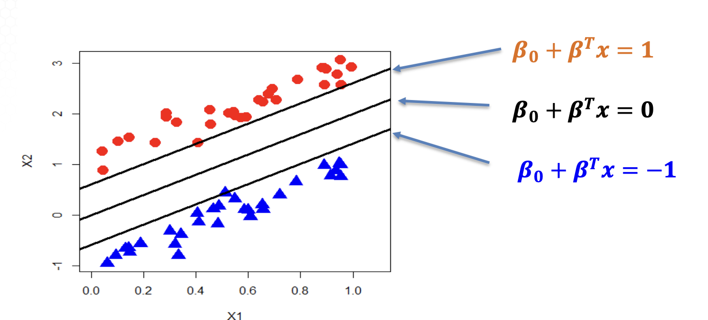

- [Distance from point to hyperplane](#orgf138ad0)
    - [Distance between hyperplanes](#org9238c77)
  - [Maximum Margin Optimization for SVM](#orgc378976)
    - [Linear classification](#orgf819a6c)
    - [Linear SVM](#orgc65e543)
    - [Margin computation](#orga7e8ce3)
    - [Maximum margin optimization](#org1c226e6)

## Distance from point to hyperplane

In the $R^{\mathbb{p}}$ space, the ****distance**** from a point $$ x_\text{new} = (x_{1, \text{new}}, x_{2, \text{new}}, ..., x_{\text{p, new}})^T $$ to thy hyperplane $$ \beta_0 + \beta_1 x_1 + \beta_2 x_2 + ... + \beta_p x_p = 0 ~ ~ ~ \text{i.e.: }\beta_0 + \beta^T x = 0 $$ is: $$ d = \frac{|\beta_0 + \beta_1 x_{1, \text{new}} + \beta_2 x_{2,\text{new}} + ... + \beta_p x_{p, \text{new}}|}{\sqrt{\beta^2_1 + \beta^2_2 + ... + \beta^2_p}} \\ = \frac{|\beta_0 + \beta^T x_{\text{new}}}{|\beta|} $$

## Distance between hyperplanes

-   In the $R^{\mathbb{p}}$ space, the distance between two hyperplanes $$ \beta_0 + \beta_1 x_1 + \beta_2 x_2 + ... + \beta_p x_p = c_1 ~ ~ ~ \text{i.e.: }\beta_0 - c_1 + \beta^T x = 0 \\ \beta_0 + \beta_1 x_1 + \beta_2 x_2 + ... + \beta_p x_p = c_2 ~ ~ ~ \text{i.e.: }\beta_0 - c_2 + \beta^T x = 0 $$ is $$ d = \frac{|c_1 - c_2|}{\sqrt{\beta^2_1 + \beta^2_2 + ... + \beta^2_p}} = \frac{|c_1 - c_2|}{|\beta|} $$
-   In the special case of $c_1 = -1$ and $c_2 = 1$, the margin or distance of the two hyperplanes is $$ d = \frac{|-1-1}{\sqrt{\beta^2_1 + \beta^2_2 + ... + \beta^2_p}} = \frac{2}{|\beta|} $$

# Maximum Margin Optimization for SVM

11.1.2

## Linear classification

-   Training dataset: - Data: $(Y_i, x_{i,1}, x_{i,2}, ..., x_{i,p}), i=1,2,...,n$ with $Y_i \in {-1,1}$
-   Linear classification: find the linear function $$ h(x) = \beta_0 + \beta_1 x_1 + \beta_2 x_2 + ... + \beta_p x_p = \beta_0 + \beta^T x $$ and predict the binary response of any new data by: $$ \text{sign} \big( h ( x ) \big) = \text{sign} \big( \beta_{0}+\beta^{T} x \big)=\left\{\begin{matrix} {{{-1}}} & {{{i f \beta_{0}+\beta^{T} x \leq0}}} \\ {{{1}}} & {{{i f \beta_{0}+\beta^{T} x > 0}}} \\ \end{matrix} \right. $$
-   Different methods to estimate $\beta_0$ and $\beta$ from training data:
    -   Linear discriminant analysis
    -   Logistic regression
    -   Support vector machine (when linearly separable)

## Linear SVM

-   Linear SVM in the linearly separable scenario
-   Given the direction $\beta = (\beta_1, \beta_2, ..., \beta_p)$, there are 3 lines / hyperplanes of the form $$ \beta_0 + \beta_1 x_1 + \beta_2 x_2 + ... + \beta_p x_p = 0 $$ Not unique, e.g. multiplying 3 both sides
-   For uniqueness, we assume ****two boundary lines**** of two classes are defined by $$ \beta_0 + \beta_1 x_1 + \beta_2 x_2 + ... + \beta_p x_p = - 1 \\ \beta_0 + \beta_1 x_1 + \beta_2 x_2 + ... + \beta_p x_p = 1 $$

## Margin computation

 Margin = $$ \frac{2}{\parallel\beta\parallel} = \frac{2}{\sqrt{\beta^2_1 + ... + \beta^2_p}} $$

## Maximum margin optimization

Consider the scenario when the training data are linearly separable.

-   Linear SVM classifier: $$ \hat{Y} = \text{sign}(\beta_0 + \beta_1 x_1 + \beta_2 x_2 + ... + \beta_p x_p) $$
-   Objective: maximize the margin $$ \frac{2}{\parallel\beta\parallel} = \frac{2}{\sqrt{\beta^2_1 + ... + \beta^2_p}} $$
